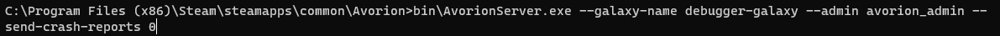
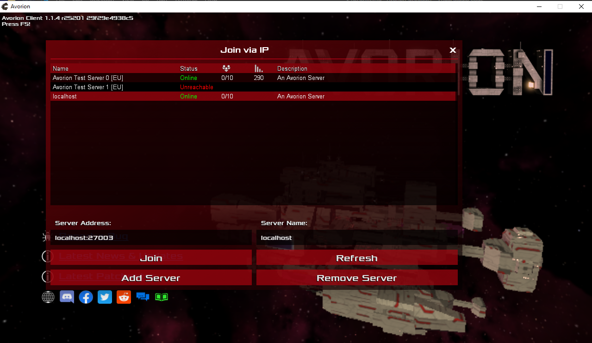
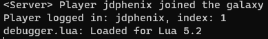
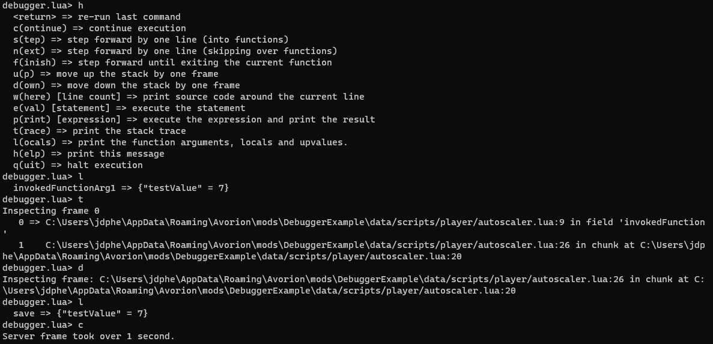

# Avorion Mod Debugger

Any material here is intended for use by Avorion mod writers. 
If you are trying to use mods, refer to [instructions here](https://avorion.gamepedia.com/Using_Mods).

A debugger script, modified to work with Avorion's lua
implementation. This allows for interactive debugging and
breakpoints in Avorion mod code. The interactive session
is in a server console. 

A debugger allows you to inspect the traceback, local variables,
step through code one line at a time and other functions that are
very useful during mod development. 

This currently supports server-side scripts.

This would not have been possible without Scott Lembcke's 
debugger - 
https://github.com/slembcke/debugger.lua. 

# How to Use

Add the *debugger.lua* file to your mod under *data/scripts*. 

    YourModFolder
    |
    |-data
      |-scripts
        |-debugger.lua

In any script you want to set breakpoints, add `local dbg = include("debugger")` to the top. Remove this line and any calls to `dbg()`
when you are ready to release your mod.

* `dbg()` - Always break immediately after this line. 
* `dbg(<conditional>)` - Break if the provided condition is false. 
For example, `dbg(5 < 3)` would break.

Review the code in [autoscaler.lua](DebuggerExample/data/scripts/player/autoscaler.lua) to see usage. If you don't understand this
script, review the documentation for a Player script (<avorion_install_path>/Documentation/index.html, then Player under 
Predefined Functions & Example Scripts). 

When using the debugger, make sure you start the server with `--send-crash-reports 0`. Long pauses in execution are 
interpreted as a crash and reported to Boxelware, which are 
useless in this context (you triggered it!). 

# Example Session

Follow along with the example mod in this repository. Follow [these instructions](https://avorion.gamepedia.com/Using_Mods) to load the mod in [this folder](DebuggerExample) as a non-Workshop mod.

The debugger example mod included does the minimum to attach a script to Player and show the debugger. 

1. Create a test galaxy. Remember the name of the galaxy
for later use and make sure DebuggerExample is enabled.

2. Find your Avorion install path, and start the server. The galaxy "debugger_galaxy" was used here. Once running, you should see a few lines print in the console, the last of which is "`Server startup complete.`"

3. Join your server using the Avorion client. Make sure you see
a line indicating the debugger loaded in the server console.

3. At the server console, type "`/save`" to trigger the mod's `Autoscaler.secure()` function. You should see a prompt "`debugger.lua>`", which indicates it is ready for commands. Use `h` to print help text, and explore the debugger functions. The screenshow below shows an example interactive session showing the help, locals and trace command. 

# License

Copyright (c) 2020 Justin Davis

Permission is hereby granted, free of charge, to any person obtaining a copy
of this software and associated documentation files (the "Software"), to deal
in the Software without restriction, including without limitation the rights
to use, copy, modify, merge, publish, distribute, sublicense, and/or sell
copies of the Software, and to permit persons to whom the Software is
furnished to do so, subject to the following conditions:

The above copyright notice and this permission notice shall be included in
all copies or substantial portions of the Software.

THE SOFTWARE IS PROVIDED "AS IS", WITHOUT WARRANTY OF ANY KIND, EXPRESS OR
IMPLIED, INCLUDING BUT NOT LIMITED TO THE WARRANTIES OF MERCHANTABILITY,
FITNESS FOR A PARTICULAR PURPOSE AND NONINFRINGEMENT. IN NO EVENT SHALL THE
AUTHORS OR COPYRIGHT HOLDERS BE LIABLE FOR ANY CLAIM, DAMAGES OR OTHER
LIABILITY, WHETHER IN AN ACTION OF CONTRACT, TORT OR OTHERWISE, ARISING FROM,
OUT OF OR IN CONNECTION WITH THE SOFTWARE OR THE USE OR OTHER DEALINGS IN THE
SOFTWARE.
